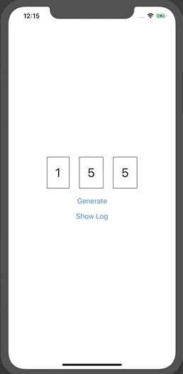

This a React Native application that generates random numbers and stores the history.

Technologies:
- React Native
- TypeScript
- Redux

This app uses Expo, steps to run the project:
- `yarn`
- `yarn ios` (`yarn android`)
- open Expo application (it may not open automatically and can be installed on the second screen)
